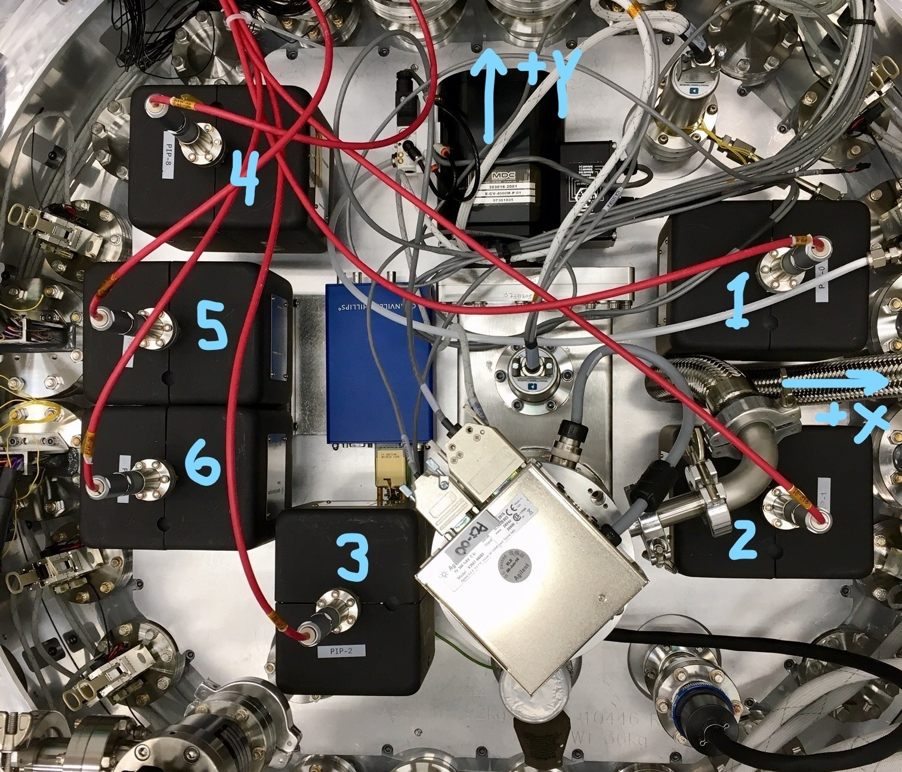
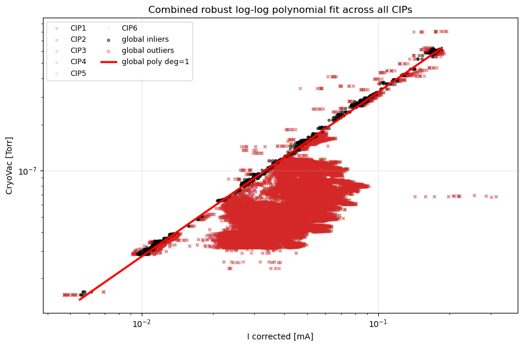
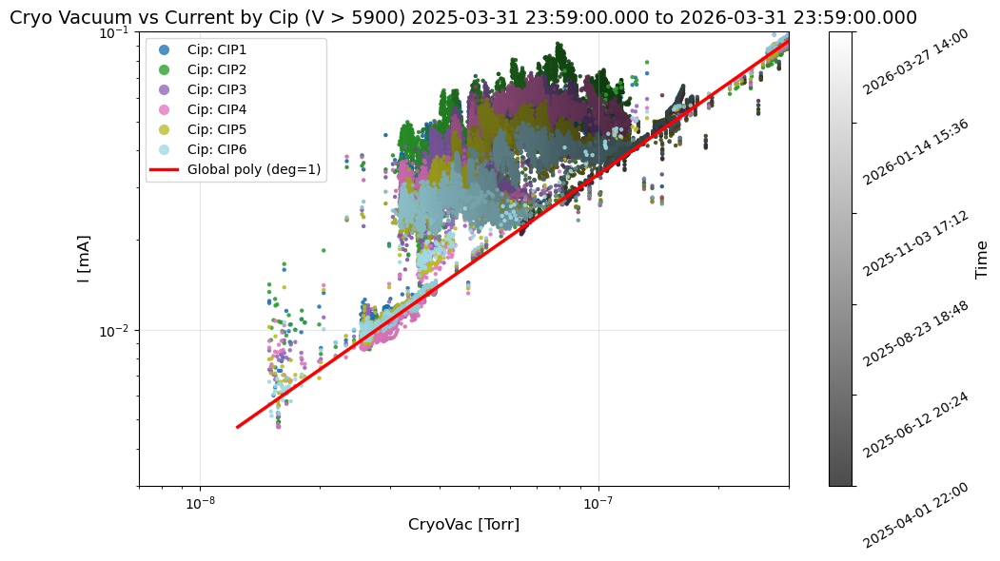
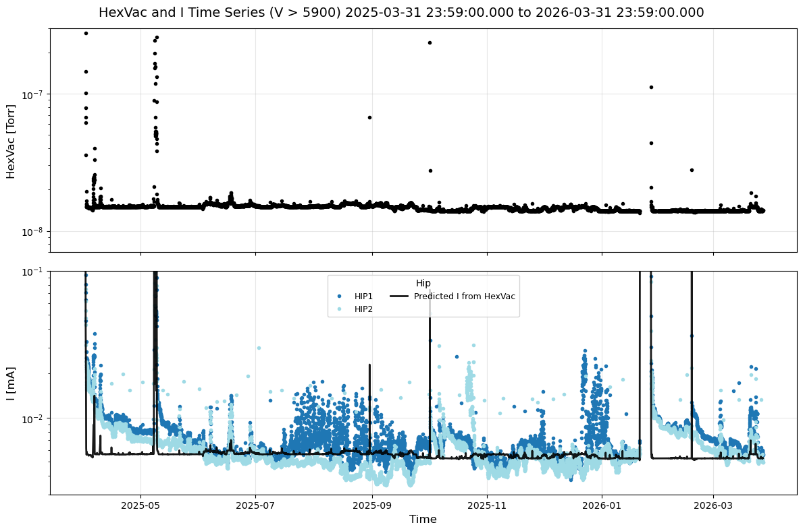
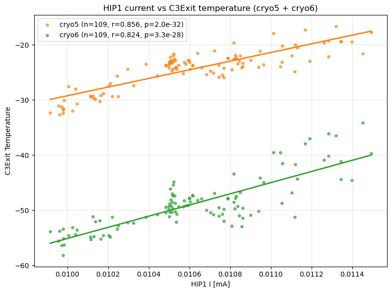

s technote describes the current measurements from the ion pump with respect to the vacuum pressure. What to expect and what could go wrong.
```

## Introduction of the LSST Camera vacuum and pumps
The LSST Camera has 201 4k x 4k CCDs and their readout electronics installed in a 450L vacuum cryostat. In operation period on the telescope, the vacuum pressure is maintained by 6 ion pumps installed on the back of the camera cryostat, the pump plate. The ion pump is Agient's VacIon Plus 20 Pump (StarCell model). Each ion pump provides a pumping speed of 20L/s. With six identical pumps, the total pumping speed is 120L/s.



## Calibration
The ion pump applies a high voltage of 6kV and measures current in a nominally operating condition. The current relates to the amount of molecules in the volume, hence it becomes another probe of the vacuum.

### Recalibration of the baseline
On February 12, 2026, the ion pumps were off, causing a scatter in the measured currents among the six pumps. The baseline current was attempted to be recorded as the mean of the off state over a time period.

| Pump name | baseline current [mA] |
|-----------|:----------------------:|
| CIP1      | 0.010815552670488914   |
| CIP2      | 0.005631903077559497   |
| CIP3      | 0.007629892204804395   |
| CIP4      | 0.018365769469548786   |
| CIP5      | 0.007770356480406705   |
| CIP6      | 0.023633742909582835   |

The current measurements with the baseline correction provide excellent agreement of the current measurements among 6 ion pumps after the vacuum repair fix on Feb 12, 2026, which convinces us that the 

### I-P Fitting
Agilent provides a current-pressure (I-P) diagram. The relationship appears mostly linear but curves over decades. We limit the pressure range of our ion pumps and derive an empirical linear relationship in the log-log plane. After vacuum repair and baseline correction, I-P measurements show excellent agreement among six circuits. We fitted the data using this period and measurements from all six circuits, assuming the relationship is universal. We initially guessed the tight relation and then aggressively rejected outliers to ensure the fitting is not affected. It provides reasonable fit over $10^{-8}$ to $10^{-6}$ Torr.



The derived fitted formula is:

$ \log(I/{\rm [mA]}) = a\log(P/{\rm [Torr]}) + b$

where the parameters are:

| param | value |
|-------|-------|
| a     | 1.068 |
| b     | -5.42 |

## Result
The I-P relationship predicts the current from the pressure measurement. A vacuum gauge (MKS 974B) is installed on the pump plate. The cold cathode reading measures the cryostat vacuum, which we compare with ion pump currents over a year. In the next figure, time seriese of cryostat vacuum and ion pump currents as well as the predicted curent are displayed.


the vacuum pressure trended downward with multiple spikes in mainly vacuum pressure. Some of them correspond to the events like filter dryer change after the frist exeprience of cryo temp sensitivity issue (May 2025), loss of dynalene cooling (Aug 2025), Cryo circuit maintenance (Oct 2025), and mysterious Cryo 6 lost (Nov 2025). On, Jan 21, 2026 the Camera experienced uncontrolled warm up due to the loss of Dyanalene cooling system for an extended period of time and March 2026, the Camera's PCS was lost due to the blown fan unit.

The plot shows major periods. In the beginning the current measruements are consistent, and then from the beginning to January 21, 2026, the inconsistent currents and pressure also started to be evident. After the vacuum leak was found to be developed ~ January 28, inconsisteincies become small. After the vacuum leak fix, the current measurements aligned with the predicted vacuum pressure for a while, but inconsistency reappeared in late March 2026.

In a different projection, the I and P plane is shown in the next figure. The data points clearly follow the prediction (red) or not. During periods when current measurements exceed the prediction, two to three times higher currents have been observed. Recently, after the new behavior emerged in late March 2026, the inconsistency is subtle compared to the previous situation, but still shows 30% higher currents.


## Implication
How to inpterpret the consitency and the inconsitency between the current and pressure? One easy explanation is the difference of the pumping speed due to the difference in gas. [MKS] tables the gas correction factor $K$ for various gases with respect to Nitrogen for ionization vacuum gauges to relate the reading $P_{\rm read}$ to the true measurement $P_{\rm true}$ by $P_{\rm true}=P_{\rm read}/K$. Here we summarizes the important gas for cathode gauge. 

| Gas      | Symbol | Gas correction factor | 
|----------|--------|-----------------------|
| Air      |        | 1.00                  |
| Hydrogen | H2     | 0.46                  |
| Helium   | He     | 0.18                  |
| Oxgen    | O2     | 1.01                  |
| Nitrogen | N2     | 1.00                  |

[MKS]: https://www.mks.com/n/gas-correction-factors-for-ionization-vacuum-gauges

Note that these argument does not directly apply to ion pump currents because the ion pump current depends not only on ionization probability but also on gas-dependent pumping mechanisms.

The significant leak developed after January 28, 2026. The ultimate vacuum pressure with six ion pumps reached at $\approx 6\times 10^{-7} {\rm [Torr]}$, with no inconsistencies in currents observed. The interpretation was that the air leak was significant, and there were no inconsistencies in seeing different gas types.

The interpretation of the downward trending from April 2025 to Jan 2026 remains uncertain. The presence of a very small leak could cause inhomogenities in gas types depending on the pump location, resulting in the inconsistencies. Another possibility is a virtual leak which could result in the same consequence.

## Conclusion
Applying the baseline correction from the "off" period is effective for calibrating ion pump current measurements. The correction provides consistent results from $10^{-8}$ to $10^{-6}$ Torr. Higher pressures were not studied.

With good calibration, studying current differences among circuits with geometrical knowledge offers insightful information. An immediate interpretation is gas type inhomogeneity, but geometry speculation can also suggest leak locations.

Once the leak becomes significant, the inconsistency disappears. It doesn't indicate the presence of a leak; it only reveals gas type inhomogeneity.

## Note about Hex
The baseline correction method has been applied to the Hex measurements. The table below shows the baseline correction.

| Pump name | baseline current  [mA] |
|-----------|:----------------------:|
| HIP1      | 0.004332               |
| HIP2      | 0.003977               |

Since the same model of the ion pumps have been used, the same I-P relation has been applied.


The predicted current from the vacuum pressure generally agree with the real current measurements, however there are two major points that are worth noting here. The current measurements took some time to come down to agree with the prediction if the pressure goes to high. This could also be interpreted as seeing different types of dominant outgassing component.

HIP1's current spreads more than HIP2 and is generally high. The numbering of HIP1 and HIP2 is uncertain, making interpretation difficult. However, HIP1 appears to be on the Hex chamber carrying Cryo 1-4 pipings, while HIP2 carries Cryo 5-6 and the PCS Cold system piping. The gauge is on HIP1. We assume like this way based on observation

Initially, the PCS piping was thought to be the source of the warm surface causing outgassing. However, the PCS piping is around -50C and the temperature is well controlled. There's no reason for fluctuations. Instead, the correlation between HIP1 currents and C3Exit of cryo circuits suggests that the warm phase of the liquid component of cryo circuits, around -20C, is the source of the oscillation.


## Appendix
In TimesSquare, [vacuum](https://usdf-rsp.slac.stanford.edu/times-square/github/lsst/CameraTimesSquare/operations/vacuum) notebook has been created. This notebook provides access to the historical measurement of vacuum pressure and corrected ion pump current. 

For a shorter time period (10days), a time bin of 5min should be seleced, where as 1h for a longer time period like 365days or more so that the query doesn't exceed the limit of the EFD (200,000 entries).

This notebook allows you to change the parameters of the current and pressure relation.


## Useful reading resouces

- https://uspas.fnal.gov/materials/15ODU/Session4_2_IonPumps.pdf
- https://www.mks.com/f/974b-quadmag-cold-cathode-transducer
- https://www.mks.com/n/gas-correction-factors-for-ionization-vacuum-gauges