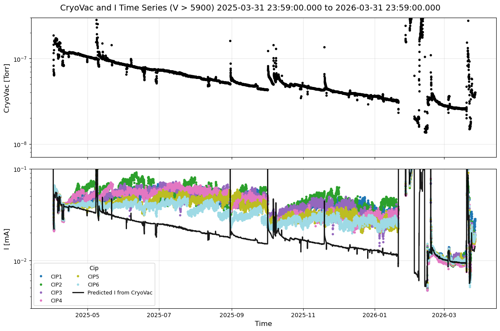

# LSST Camera's Ion pump current measurements

```{abstract}
This technote describes the vacuum system of the LSST Camera, focusing on ion pump current measurements in relation to vacuum pressure. While a relationship between vacuum pressure and current is expected, this document details the baseline correction for ion pump current measurement, demonstrates consistent correlation between current and pressure readings, compares pressures with "predicted" currents from ion pumps, and provides interpretation of these comparisons.
```

## Introduction to the LSST Camera Vacuum System
The LSST Camera has 201 4k x 4k CCDs and their readout electronics installed in a 450L vacuum cryostat. In the cryostat, there are two thermal zones: Cryo for -130C and Cold for -50C. The CCDs are cooled on the Cryo plate, while the readout electronics are cooled on the Cold plate. As the Cryo plate is colder than the sublimation temperature of water vapor at the achieved pressure of $~10^{-8}$ Torr, the Cryo plate also acts as a cryo pump. 

During the operational period on the telescope, the vacuum pressure is mainly maintained in the order of $10^{-8}$ Torr by 6 ion pumps installed on the back of the camera cryostat, the pump plate. The ion pump is Agilent's VacIon Plus 20 Pump (StarCell model). Each ion pump provides a pumping speed of 20L/s. With six identical pumps, the total pumping speed is 120L/s.


The pump plate also has a vacuum gauge, the MKS 974B, which has three stages of gauges (Piezo, Micro Pirani, Cold Cathode) to provide a wide range of measurements from twice atmospheric pressure down to $10^{-8}$ Torr.
This gauge has been calibrated against N2 at the atmospheric pressure at the summit of Cerro Pachón, acknowledging that the reduced pressure is 560 Torr.


## Calibration
The ion pump applies a high voltage of 6kV to a pumping element and measures current in a nominally operating condition ([NIH]). The current relates to the amount of molecules in the volume, hence it becomes another probe of the vacuum, if the calibration has been made correctly. In this document we aim to understand the calibration and discuss the application of two probes of the gauge and the ion pumps.

[NIH]: https://pmc.ncbi.nlm.nih.gov/articles/PMC6513016/#S5

### The baseline correction
On February 12, 2026, the ion pumps were turned off, revealing scatter in the measured currents among the six pumps. The baseline current was recorded as the mean of the off-state measurements over a time period. At pressures around $10^{-8}$ Torr, microampere (µA) level currents become significant.


| Pump name | Baseline current [mA] |
|-----------|:---------------------:|
| CIP1      | 0.0108                |
| CIP2      | 0.0056                |
| CIP3      | 0.0076                |
| CIP4      | 0.0183                |
| CIP5      | 0.0077                |
| CIP6      | 0.0236                |


The current measurements with baseline correction show excellent agreement among the six ion pumps after the vacuum repair on February 12, 2026, as well as during the initial operation period in April 2025.

The [Agilent Technical Note] discusses baseline current (leakage current) in both internal and external contexts. Our application demonstrates an excellent I-P relationship, suggesting that the baseline current in our range of concern is likely due to miscalibration rather than a fundamental issue.

[Agilent technical note]: https://www.agilent.com/cs/library/technicaloverviews/public/Copy%20of%20technical-overview-how-to-optimize-ion-pump-performance-by-selecting-the-correct-operating-voltage-5994-2668en-agilent.pdf

### I-P Fitting
Agilent provides a current-pressure (I-P) diagram. The relationship appears mostly linear but curves over decades. We limit the pressure range of our ion pumps and derive an empirical linear relationship in the log-log plane. After vacuum repair and baseline correction, I-P measurements show excellent agreement among six circuits. We fitted the data using this period and measurements from all six circuits, assuming the relationship is universal. We assumed a strong correlation between current and pressure, then systematically removed outliers to prevent them from affecting the fit quality. It provides reasonable fit over $10^{-8}$ to $10^{-6}$ Torr.


The derived fitted formula is:

$ \log(I/{\rm [mA]}) = a\log(P/{\rm [Torr]}) + b$

where the parameters are:

| param | value |
|-------|-------|
| a     | 1.068 |
| b     | -5.42 |

## Result
### Camera Cryostat
The I-P relationship predicts the current from the pressure measurement. A vacuum gauge (MKS 974B) is installed on the pump plate. The cold cathode reading measures the cryostat vacuum, which we compare with ion pump currents over a year. In the next figure, time series of cryostat vacuum and ion pump currents as well as the predicted current are displayed.


the vacuum pressure trended downward with multiple pressure spikes. Some of them correspond to the events like filter dryer change after the first experience of cryo temp sensitivity issue (May 2025), loss of dynalene cooling (August 2025), Cryo circuit maintenance (October 2025), and mysterious Cryo 6 lost (Nov 2025). On January 21, 2026, the Camera experienced uncontrolled warm up due to the loss of Dynalene cooling system for an extended period of time, and in March 2026, the Camera's PCS was lost due to the blown fan unit.

The plot shows major periods. In the beginning the current measurements are consistent, and then from the beginning to January 21, 2026, the inconsistent currents and pressure also started to be evident. After the vacuum leak was discovered around January 28, inconsistencies become small. After the vacuum leak fix, the current measurements aligned with the predicted vacuum pressure for a while, but inconsistency reappeared in late March 2026.

In a different projection, the I and P plane is shown in the next figure. The data points clearly follow the prediction (red) or not. During periods when current measurements exceed the prediction, two to three times higher currents have been observed. Recently, after the new behavior emerged in late March 2026, the inconsistency is subtle compared to the previous situation, but still shows 30% higher currents.


### Hex chamber
Another vacuum chamber exists in the LSST Camera, which is the Hex. The Hex consists of two mostly identical chambers, containing the heat exchanger for the cryo circuits as well as the routes for the PCS cold tubing, where it used to be the heat exchanger for the previous cold system. As the Hex also uses the same model of the ion pumps, the same analysis has been applied to the Hex. The table below shows the baseline correction.

| Pump name | baseline current  [mA] |
|-----------|:----------------------:|
| HIP1      | 0.004332               |
| HIP2      | 0.003977               |

Since the same model of the ion pumps have been used, the same I-P relation has been applied.


The predicted current from the vacuum pressure generally agrees with the actual current measurements, however there are two major points that are worth noting here. The current measurements took some time to come down to agree with the prediction if the pressure goes to high. This could also be interpreted as seeing different types of dominant outgassing component.

HIP1's current spreads more than HIP2 and is generally high. The numbering of HIP1 and HIP2 is uncertain, making interpretation difficult. However, HIP1 appears to be on the Hex chamber carrying Cryo 1-4 pipings, while HIP2 carries Cryo 5-6 and the PCS Cold system piping. The gauge is on the same side as HIP1. We assume this arrangement based on observations.

Initially, the PCS piping was thought to be the source of the warm surface causing outgassing. However, the PCS piping carries liquid around -50C and the temperature is well controlled. There's no reason for fluctuations. Instead, the correlation between HIP1 currents and C3Exit of cryo circuits suggests that the warm phase of the liquid component of cryo circuits, around -20C, is the source of the oscillation.


## Implication

How to interpret the consistency and the inconsistency between the current and pressure? A straightforward explanation involves differences in pumping speeds caused by variations in gas composition. [MKS] and [Edwards] table the gas correction factor $K$ for various gases with respect to Nitrogen for ionization vacuum gauges to relate the reading $P_{\rm read}$ to the true measurement $P_{\rm true}$ by $P_{\rm true}=P_{\rm read}/K$. Here we summarize the important gases for the cold cathode gauge.

| Gas             | Symbol | Gas correction factor | 
|-----------------|--------|-----------------------|
| Air             |        | 1.00                  |
| Hydrogen        | H2     | 0.46                  |
| Helium          | He     | 0.18                  |
| Oxygen          | O2     | 1.01                  |
| Nitrogen        | N2     | 1.00                  |
| Carbon Dioxide  | CO2    | 1.05                  |
| Carbon Monoxide | CO     | 1.42                  |

[MKS]: https://www.mks.com/n/gas-correction-factors-for-ionization-vacuum-gauges
[Edwards]: https://www.edwardsvacuum.com/content/dam/brands/edwards-vacuum/general-vacuum/gated-downloads/application-notes/3601-2064-01_Calibration-factors-for-vacuum-pressure-gauges.pdf

Note that these arguments do not directly apply to ion pump currents because the ion pump current depends not only on ionization probability but also on gas-dependent pumping mechanisms.

Speculation of the gas species can be made from the relationship between the ion pump current and the measured pressure. 
Assuming a relation of $I = K P^n$ with $n ≈ 1$, the coefficient $K$ reflects the gas species through its ionization and pumping characteristics.

In some major periods, the observed current is systematically higher than the predicted relation by a factor of ~2–3. 
This can be quantitatively explained by the known sensitivity ratios:
$K_{N2} / K_{H2} \approx 2.17$ and $K_{CO} / K_{H2} \approx 3.08$.
Therefore, the observed deviation is consistent with a temporary dominance of heavier gases such as CO or N2 relative to hydrogen.

After long-term operation, however, the system shows a stable and reproducible I–P relationship with a lower K value. 
This indicates that the gas composition has converged to a hydrogen-dominated state, since hydrogen has the lowest effective K among common residual gases.

The presence of cryo-pumping surfaces plays a key role in this evolution.  Water vapor and CO2 are efficiently trapped at low temperatures, leading to gradual depletion of these species from the gas phase. As a result, hydrogen—continuously supplied from material outgassing—becomes dominant.

This depletion process is less effective in vacuum systems without cryogenic surfaces (such as the Hex chamber),  where residual gases such as water vapor and CO-related species remain in the gas phase longer.  This difference naturally explains the observed inconsistency between systems.

The interpretation of the downward trending from April 2025 to January 2026 remains uncertain. The presence of a very small leak could cause inhomogenities in gas types depending on the pump location, resulting in the inconsistencies. However, the downward trend is hard to explain. Another possibility is a virtual leak which could result in the same consequence, which could explain the downward trend.

The significant leak developed after January 28, 2026. The ultimate vacuum pressure with six ion pumps reached at $\approx 6\times 10^{-7}$ [Torr], with no inconsistencies in currents observed. The interpretation was that the air leak was significant, where the air leak dominates the gas composition with a single dominant species (nitrogen).

## Conclusion
Applying the baseline correction from the "off" period is effective for calibrating ion pump current measurements. The correction provides consistent results from $10^{-8}$ to $10^{-6}$ Torr. Higher pressures were not studied.

With good calibration, studying current differences among circuits with geometrical knowledge offers insightful information. An immediate interpretation is gas type inhomogeneity, but geometry speculation can also suggest leak locations.

Once the leak becomes significant, the inconsistency disappears. It doesn't indicate the presence of a leak; it only reveals gas type inhomogeneity.


## Appendix
### Times Square Notebook
In Times Square, the [vacuum](https://usdf-rsp.slac.stanford.edu/times-square/github/lsst/CameraTimesSquare/operations/vacuum) notebook is now available. This notebook provides access to the historical measurement of vacuum pressure and corrected ion pump current. 

For a shorter time period (10days), a time bin of 5min should be selected, whereas 1h for a longer time period like 365days or more so that the query doesn't exceed the limit of the EFD (200,000 entries).

This notebook allows you to change the parameters of the current and pressure relation.


### Note about the effective pumping speed 
Estimation of the effective pumping rate, $S_{\rm 6I}$, of the 6 ion pumps is 11.4 L/s. This estimate is from the best rate-of-rise measurement when there was no inconsistency in the currents and pressure and using Aaron's relative pumping speed of $S_T / S_{6I} = 2.2$, which was confirmed to be correct when we ran both systems at the same time.  The total pumping speed appears to be greatly reduced by the complexity of the system. 

$1/S_{\rm eff} = 1/S_{\rm 6I} + 1/C$, where $C$ represents the conductance of the system. $C \approx 12.6$ L/s. The reason for the small conductance is likely due to placing the light baffling in front of the opening of the ion pump gauges so as to prevent any stray light from the ion pumps.

## Useful reading resources

- https://uspas.fnal.gov/materials/15ODU/Session4_2_IonPumps.pdf
- https://www.mks.com/f/974b-quadmag-cold-cathode-transducer
- https://www.mks.com/n/gas-correction-factors-for-ionization-vacuum-gauges